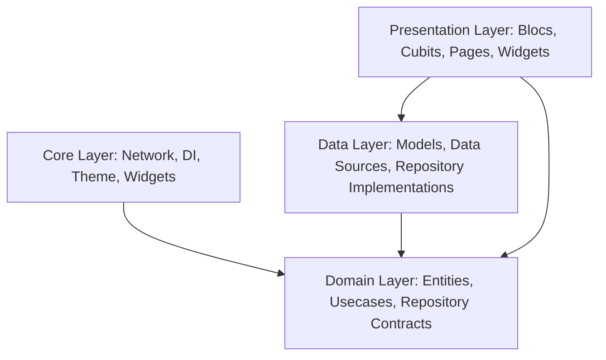

# ReadBuddy - Complete Project Guide & Codebase Documentation

Welcome to **ReadBuddy**, a premium community book-sharing and donation platform built using Flutter and Dart. This document provides a complete overview of the project setup, architectural standards, features, and workflows.

---

## 1. Project Architecture (Flutter Clean Architecture)

The project is organized according to **Clean Architecture** patterns, separating concerns into distinct layers: **Core**, **Features**, and **Layout/Routing**.



### High-Level Directory Layout

- **`lib/core/`**: Shared infrastructure.
  - **`network/`**: Base HTTP configuration using `DioClient` for JSON API communication.
  - **`di/`**: Service locator container powered by `GetIt` and `injectable`.
  - **`theme/`**: Design tokens, color schemes, and Poppins font typography styles.
  - **`utils/`**: Shared utilities, formatters, and local secure storage utils.
  - **`widgets/`**: Reusable custom components (buttons, input fields, offline network wrappers).
- **`lib/features/`**: Feature-specific modules. Each feature folder contains its own layers:
  - **`domain/`**: Pure Dart code containing business entities and use cases.
  - **`data/`**: Models (extending entities with JSON parsing) and data sources (local/remote).
  - **`presentation/`**: Pages, views, custom widgets, and state management logic.

---

## 2. Key Codebase Features & Modules

### 🔑 Authentication & Profiles (`lib/features/auth/`, `lib/features/profile/`)
- Supports registering, logging in, and logging out.
- OTP verification flows for email verification and secure password reset.
- Native Google Auth integration (`GoogleSignInBloc`).
- User profile updating (avatar upload, user profile information like DOB, city, pincode, gender).

### 📚 Book Stepper & Management (`lib/features/bookcrud/`)
- Multi-step stepper flow for creating a parent book:
  - **Step 1**: Basic Details (title, author, publisher, pages, ISBN, category, genre, language).
  - **Step 2**: Sourcing & Metadata (book condition, additional notes, location autocomplete, cover image, and multiple gallery images).
  - **Step 3 (New)**: Language Variants & Formats customization.
- Autocomplete search for categories and locations (Google Maps/Places API-backed cubit).

### 🌐 Book Language Variants (`lib/features/bookcrud/`)
- A single parent book can support multiple language-specific versions and formats (Hardcover, E-Book, Audiobook).
- Prevents adding duplicate languages for the same parent book.
- Configures separate sub-forms dynamically based on active formats:
  - **Hardcover**: Tracks copies count (interactive increment widget) and validates ISBN.
  - **E-Book**: Dash upload area validating `.pdf`/`.epub` files, showing mock upload progress and size.
  - **Audiobook**: Narration track upload (.mp3/.wav/.m4a) and duration tracking.

### 📥 Book Requests & Fulfillment (`lib/features/book_request/`)
- Users browse book details and place borrow requests.
- Requests support different fulfillment methods: **DELIVERY** (courier to home), **PICKUP** (from nearest library), or **MEETUP**.
- Integrated with Razorpay order creation and payment verification to unlock shipping.
- Admin dashboard to approve, reject, schedule pickups, update courier status, and monitor returns.

### 🎁 Book & Monetary Donations (`lib/features/donate/`, `lib/features/donated_books/`)
- Physical book donations via Courier Drop-off or Pickup collection.
- Local library locator using pincodes or Lat/Lng to find nearest drop-off points.
- Monetary donation support with Razorpay orders to grant Prime/Premium memberships.
- Admin dashboard to track donations, check uploaded shipping receipts, and update donation states.

### 🌟 Wishlist & Preferences (`lib/features/explore/`, `lib/features/mybook/`)
- Add/Remove books to personal wishlist databases.
- Initial user preference onboarding questionnaires.

---

## 3. Technology Stack & Packages

- **State Management**: `flutter_bloc` for Blocs and Cubits, separating state transitions from layouts.
- **Dependency Injection**: `get_it` with `injectable_generator` for lazy singleton registrations.
- **Networking**: `dio` client with secure token headers and automatic request logging.
- **Secure Persistence**: `flutter_secure_storage` for refresh tokens, user profile metadata, and session caches.
- **Local Persistence**: `shared_preferences` for localized content (variants).
- **Search Dropdowns**: `dropdown_search` for type-ahead dropdown components.

---

## 4. How to Set Up & Run Locally

### Prerequisites
- Install Flutter SDK (v3.19.0+ recommended)
- Set up Android Studio, VS Code, or Xcode (for iOS builds)

### Steps

1. **Clone the Repository**:
   ```bash
   git clone <repo_url>
   cd read-buddy-app
   ```

2. **Install Package Dependencies**:
   ```bash
   flutter pub get
   ```

3. **Run Code Generation (injectable & models)**:
   This project uses code generators. To run them, execute:
   ```bash
   dart run build_runner build --delete-conflicting-outputs
   ```

4. **Verify Compilation & Static Analysis**:
   ```bash
   flutter analyze
   ```

5. **Run the Application**:
   Choose your target device (Android, iOS, Windows, or Web) and run:
   ```bash
   flutter run -d chrome
   ```
